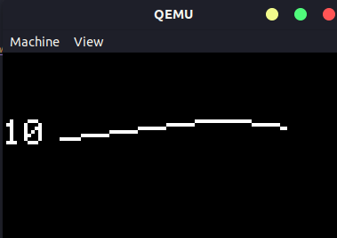
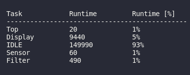

SO2 - 2021 - UNC

## Introduccion
Toda aplicación de ingenierı́a que posea requerimientos rigurosos de tiempo, y
que esté controlado por un sistema de computación, utiliza un Sistema Operativo
de Tiempo Real (RTOS, por sus siglas en inglés). Una de las caracterı́sticas
principales de este tipo de SO, es su capacidad de poseer un kernel preemtive y
un scheduler altamente configurable. Numerosas aplicaciones utilizan este tipo
de sistemas tales como aviónica, radares, satélites, etc. lo que genera un gran
interés del mercado por ingenieros especializados en esta área.

## Ejecucion
Dentro de */src* correr:

```
make all
qemu-system-arm -serial stdio -machine lm3s811evb -kernel gcc/RTOSDemo.axf
```

## Tareas

1. Una tarea que simule un sensor de temperatura. Generando valores aleato-
rios, con una frecuencia de 100 Hz.
```C
static void vTempSensorTask(void *p);
```
2. Una tarea que reciba los valores del sensor y aplique un filtro pasa bajos.
Donde cada valor resultante es el promedio de las ultimas N mediciones.
```C
static void vFilterTask(void *pvParameters)
```
3. Una tarea que grafica en el display los valores de temperatura en el tiempo.

```C
static void vDisplayTask(void *pvParameters)
```

   
4. Se debe poder recibir comandos por la interfaz UART para cambiar el N
del filtro.

```C
void vUART_ISR(void) 
```

5. Calcular el stack necesario para cada task. Realizar el análisis utilizando
uxTaskGetStackHighWaterMark o vApplicationStackOverflowHook.

Para poder hacerlo se utilizo la funcion
```uxTaskGetStackHighWaterMark(NULL);```. Se encontro que la tarea top y tarea display necesitaban mucho más, de otra manera el programa no funcionaba como es debido. Se procedieron a crear las siguientes macros para establecer los tamaños adecuados de cada task:

```C
#define configSENSOR_STACK_SIZE     ( ( unsigned short ) (40))  
#define configFILTER_STACK_SIZE     ( ( unsigned short ) (60)) 
#define configDISPLAY_STACK_SIZE    ( ( unsigned short ) (86))
#define configTOP_STACK_SIZE        ( ( unsigned short ) (100)) 
```

6. Implementar una tarea tipo top de linux, que muestre periódicamente
estadı́sticas de las tareas (uso de cpu, uso de memoria, etc).

```C
static void vTopTask( void *pvParameters );
```
vTopTask utiliza una funcion externa llamada ```getTasksStats( char *writeUART )``` para poder recolectar informacion como el nombre de task, el tiempo que lleva ejecutandose (runtime) y tiempo que lleva ejecutandose relativo al tiempo total (runtime[%])




Para poder utilizar estas estadisticas se debio poner en 1 la flag  ```configGENERATE_RUN_TIME_STATS``` dentro del archivo FreeRTOSConfig.h